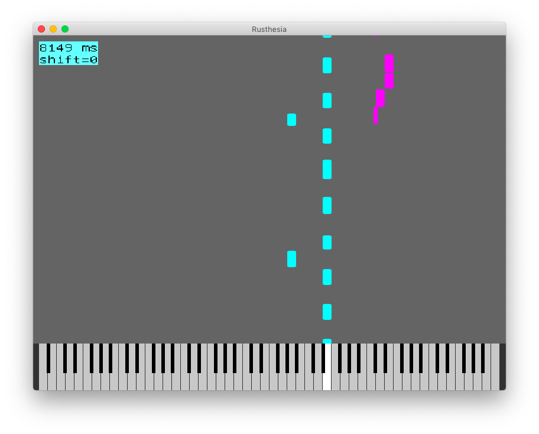

# Rusthesia

Rusthesia is till now just a hack to play a midi file, created from Logic Pro/X, and display a window with falling notes down onto a piano.

The midi file can be transposed in half notes in realtime by using shift left/right key. Playing can be paused by space.


### Audio

Synthesizer is not included. Instead midi messages will be sent via core audio. Logic Pro/X can be used for playing the midi, but has to be set up accordingly.

No idea for other operation systems, if it works or how to do. 

### Video

Screen output uses sdl2.

### Screenshot



## Preparation

The sdl2 libraries need to be installed. On macos this can be done by:

```
brew install sdl2 sdl2_gfx
```

## Installation

```
cargo install rusthesia
```

## Usage

For help just execute

```
rusthesia -h
```

As an example the midi-file 
[Marche_aux_Flambeaux.mid](http://www.mutopiaproject.org/cgibin/make-table.cgi?Instrument=Harmonium)
is included. As per that website, this file is in the public domain.

First list the available tracks:
```
> rusthesia Marche_aux_Flambeaux.mid -l
Track 0:
  Text: Creator: GNU LilyPond 2.8.7
  Text: Generated automatically by: GNU LilyPond 2.8.7
  Text: at Mon Oct 16 20:41:39 2006
  Text: at Mon Oct 16 20:41:39 2006
  Track name: Track 0
Track 1:
  Track name: upper
  Instrument name: accordion
Track 2:
  Track name: lower
  Instrument name: accordion
```

For playing and displaying all tracks use:
```
> rusthesia Marche_aux_Flambeaux.mid -p 0 1 2 -s 0 1 2
```

In order to play the lower and show only the upper, use the following command:
```
> rusthesia Marche_aux_Flambeaux.mid -p 1 -s 2
```

## Todo

- Refactoring and code quality
    - Derive the waterfall directly from the midi tracks
    - Do not redraw piano always
    - Macos does not like too many wakeups:
        Wakeups:         45001 wakeups over the last 281 seconds (160 wakeups per second average), exceeding limit of 150 wakeups per second over 300 seconds
        Wakeups limit:   45000
        Limit duration:  300s
        Wakeups caused:  45001
    - midi player should be in separate thread with realtime capability
    - allow mapping of tracks to channels
- video file
    - Create video mpeg or mp4
    - Write gif files with gifski
- Nicer looking output
    - Waterfall background with lines for orientation
    - visual effect for pressed key on waterfall side
- Native macos app with fruitbasket
- Userinterface
    - Toggle track display by pressing keys 0, 1, 2,...
    - Allow shift by double finger gesture
- Add pause before playing the midi
- Handle all meta messages during playing
- Change most of the prints into log-commands and enable logging per command line option
- Do not exit on end
- Recognize chords in realtime
- and more...

## License

The attached LICENSE file defines the license for the code of this crate only - specifically before compiling or linking. The resulting binary after linking may be problematic in regard to license incompatibilities of included crates.

Consequently automated builds outputting a binary cannot be set up.

## Final Words

The application works, but still this is a quick hack and not polished for code review ;-)

